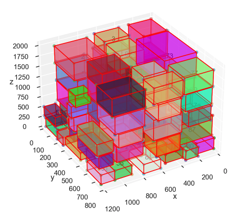

# 3D Bin Packing



This repository contains different implementations of heuristics-based and mathematical programming approaches to solve the 3D bin packing problem (3D-BPP):
1. Baseline MP model [[1]](#1)
2. Column generation MP model [[1]](#1)
3. Maxrects generalized to 3D (2D implementation based on [rectpack](https://github.com/secnot/rectpack))

All solutions are based on the concept of layers, which are collections of items having similar heights (within a pre-specified tolerance) that are thus having the same base z-coordinate. Using layers we are able to relax the 3D problem to a set of 2D ones, boosting efficiency-related metrics. Moreover, the usage of superitems (i.e. compounding similar items together in a bigger item) enables us to both lower the amount of items we are effectively dealing with and also to maximize layer density, thanks to the compact stacking of items in a superitem.

The bins building procedure is always handled in a procedural way, stacking layers on top of each other until a bin is full and opening new bins as needed. Before layers are placed in a bin, they are filtered based on a set of criteria (as described in [[1]](#1)), such as item coverage and layer density. After layers are placed in a bin, some items could still be "flying" (i.e. have zero support at their base): to solve this issue, we let items "fall" to the ground as much as possible, without allowing intersections, thus ensuring compactness and correctness.

## Solutions

Below you can find a broad explanation of each implemented solution.

### Baseline

### Column generation

### Maxrects

## Installation

In order to install all the dependecies required by the project, you can either rely on `pip` or `conda`. If you want to use the former, `cd` to the root folder of the project and run the following commands:
```bash
python3 -m venv venv
source venv/bin/activate
pip install -r init/requirements.txt
```

Instead, for the latter you'd have to run the following commands (after changing directory to the project's root):
```bash
conda env create --name 3d-bpp -f init/environment.yml
conda activate environment.yml
```

## Execution

The library can be used from another project, by importing the necessary sources from `src/` or it can be used as a standalone bin packing library, by leveraging the interface functions in `src/main.py`.

If you want to see a working example, please check out the `bpp.ipynb` Jupyter notebook, that contains an explanation of the dataset in use, along with a comparison of all the implemented solutions.

For a more entertaining and interactive solution, you can also run the implemented [Streamlit](https://streamlit.io/) dashboard, by simply running the following command from the root of the project:
```bash
python3 -m streamlit run src/dashboard.py
```

## References
- <a id="1">[1]</a>
  _Samir Elhedhli, Fatma Gzara and Burak Yildiz (2019)_.\
  **Three-Dimensional Bin Packing and Mixed-Case Palletization**.\
  INFORMS Journal on Optimization
- <a id="2">[2]</a>
  _Silvano Martello, David Pisinger and Daniele Vigo (1998)_.\
  **The Three-Dimensional Bin Packing Problem**.\
  Operations Research
